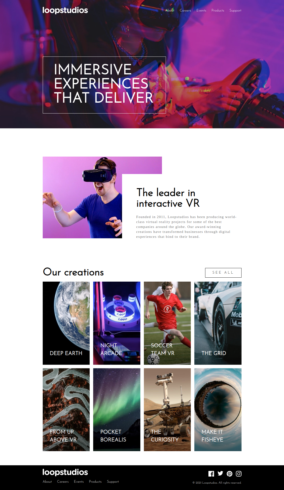

<!-- @format -->

# Frontend Mentor - Loopstudios landing page solution

Solução do desafio [Loopstudios landing page challenge on Frontend Mentor](https://www.frontendmentor.io/challenges/loopstudios-landing-page-N88J5Onjw).

## O Desafio

Os usuário devem:

- Visualizar o layout para o site e criá-lo conforme o tamanho da tela sugerido
- Ver os efeitos de hover para todas as interações dos elementos da página

## Screenshot Versão Desktop

## Links

- Acesse o Site: [Loopstudios](https://vitorsemidio-dev.github.io/fm-loopstudios)

### Recursos úteis

- [Video - Create Responsive Navigation nav With no JS](https://www.youtube.com/watch?v=8QKOaTYvYUA) - Ajudou a construir menu responsivo sem utilizar JS
- [Codepen Responsive navbar](https://codepen.io/kevinpowell/pen/jxppmr?editors=1100) - Código fonte do vídeo acima.

## Autor

<kbd>
 
 </kbd>
  
 <strong>🌟 Vitor Emídio 🌟</strong>

